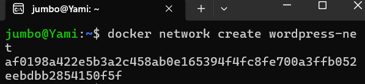
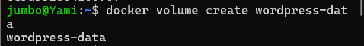
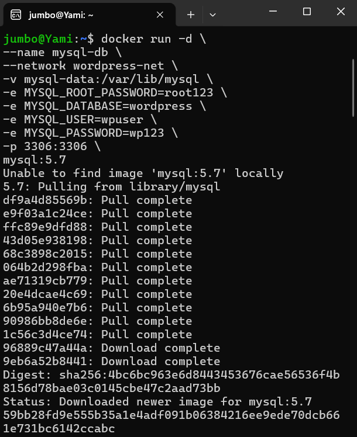
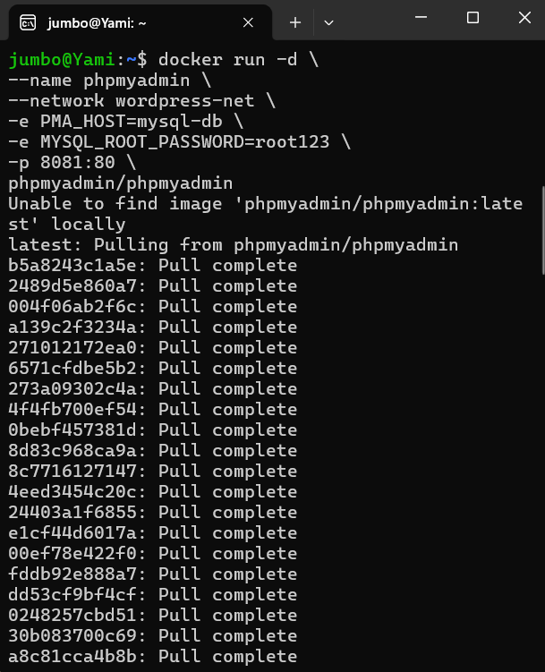
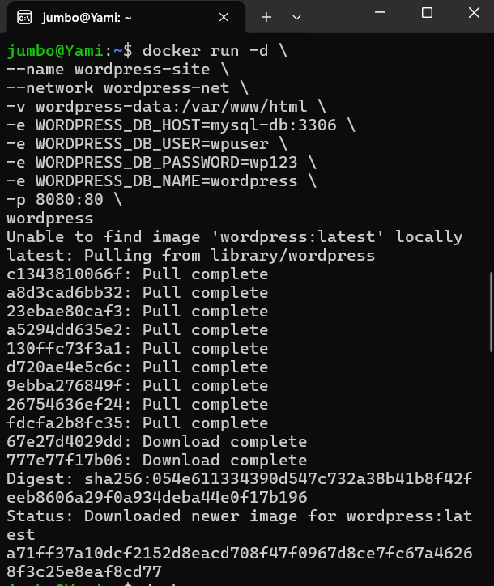
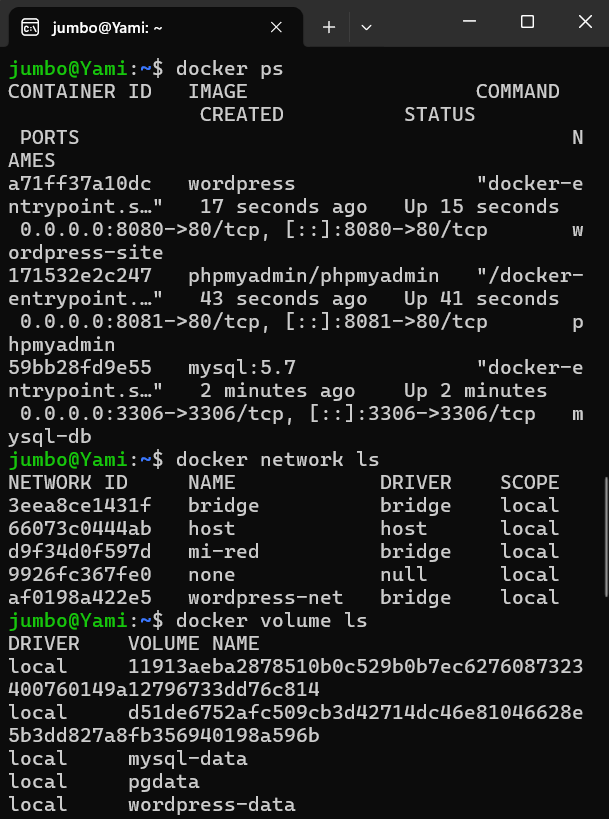
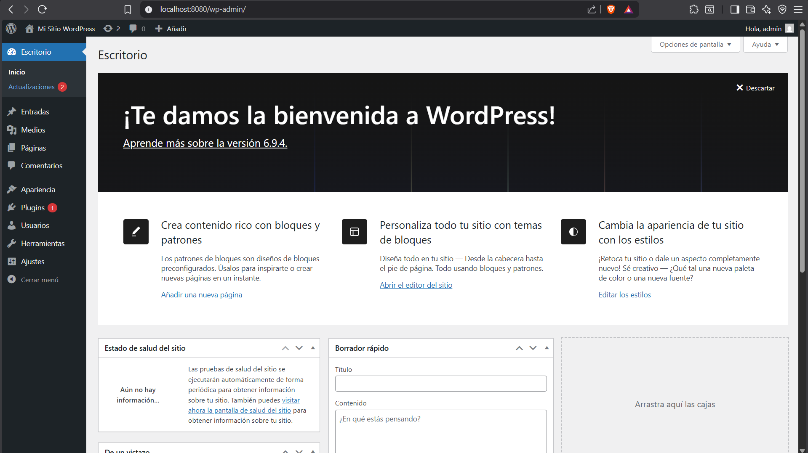
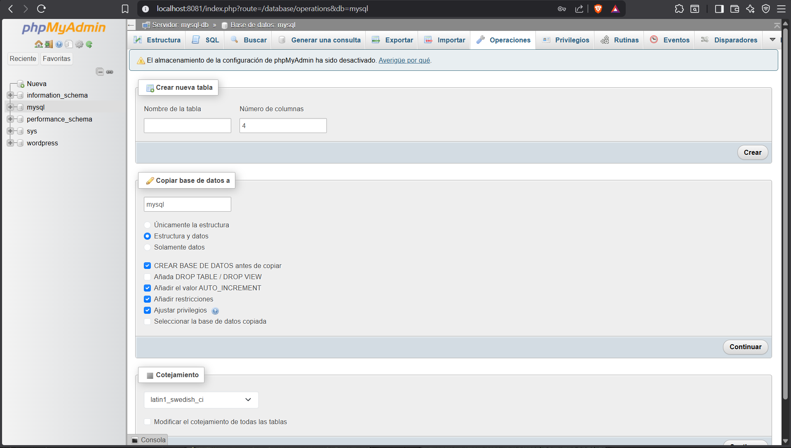

# Práctica Semana 5 - WordPress con Docker

## Objetivo

Implementar un entorno WordPress utilizando contenedores Docker, configurando servicios de MySQL y phpMyAdmin mediante redes y volúmenes.

---

# Herramientas utilizadas

- Docker
- Docker Desktop
- Ubuntu WSL
- WordPress
- MySQL
- phpMyAdmin

---

# Creación de la red Docker

docker network create wordpress-net

---

# Creación de volúmenes

## Volumen para WordPress

docker volume create wordpress-data

## Volumen para MySQL

docker volume create mysql-data

---

# Creación del contenedor MySQL

docker run -d \
--name mysql-db \
--network wordpress-net \
-v mysql-data:/var/lib/mysql \
-e MYSQL_ROOT_PASSWORD=root123 \
-e MYSQL_DATABASE=wordpress \
-e MYSQL_USER=wpuser \
-e MYSQL_PASSWORD=wp123 \
-p 3306:3306 \
mysql:5.7

---

# Creación del contenedor phpMyAdmin

docker run -d \
--name phpmyadmin \
--network wordpress-net \
-e PMA_HOST=mysql-db \
-e MYSQL_ROOT_PASSWORD=root123 \
-p 8081:80 \
phpmyadmin/phpmyadmin

---

# Creación del contenedor WordPress

docker run -d \
--name wordpress-site \
--network wordpress-net \
-v wordpress-data:/var/www/html \
-e WORDPRESS_DB_HOST=mysql-db:3306 \
-e WORDPRESS_DB_USER=wpuser \
-e WORDPRESS_DB_PASSWORD=wp123 \
-e WORDPRESS_DB_NAME=wordpress \
-p 8080:80 \
wordpress

---

# Verificación de contenedores

docker ps

Resultado:

- WordPress funcionando en el puerto 8080
- phpMyAdmin funcionando en el puerto 8081
- MySQL funcionando en el puerto 3306

---

# Verificación de redes

docker network ls

---

# Verificación de volúmenes

docker volume ls

---

# Acceso a los servicios

## WordPress

http://localhost:8080

## phpMyAdmin

http://localhost:8081

Usuario:

root

Contraseña:

root123

---

# Diagrama de contenedores

                 ┌─────────────────┐
                 │   phpMyAdmin    │
                 │    Puerto 8081  │
                 └────────┬────────┘
                          │
                    wordpress-net
                          │
      ┌───────────────────┼───────────────────┐
      │                                       │
┌─────▼─────┐                         ┌───────▼───────┐
│ WordPress │                         │    MySQL      │
│ Puerto    │                         │ Puerto 3306   │
│ 8080      │                         │               │
└─────┬─────┘                         └───────┬───────┘
      │                                       │
wordpress-data                         mysql-data

---

# Resultados obtenidos

Se logró implementar correctamente un entorno WordPress utilizando Docker. Los contenedores pudieron comunicarse mediante una red personalizada y se utilizaron volúmenes para almacenar la información persistente de WordPress y MySQL.

---

# Conclusiones

- Se aprendió a crear y administrar contenedores Docker.
- Se configuraron redes personalizadas para comunicación entre servicios.
- Se utilizaron volúmenes para persistencia de datos.
- Se desplegó correctamente WordPress con MySQL y phpMyAdmin.

---

# Evidencias

## Red Docker

---

## Volumen para WordPress

---

## Volumen para MySQL

---

## Contenedor MySQL

---

## Contenedor phpMyAdmin

---

## Contenedor WordPress

---

## Verificación de contenedores

---

## WordPress funcionando

---

## phpMyAdmin funcionando

